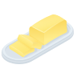
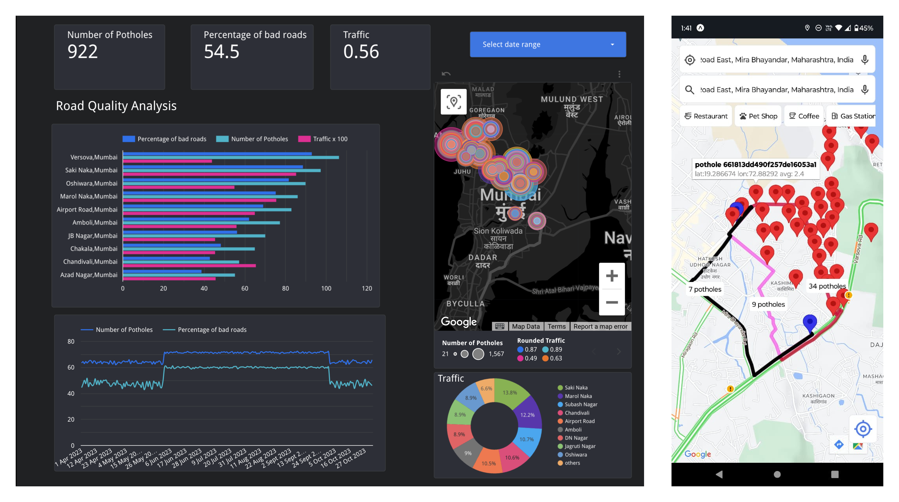

[![Contributors][contributors-shield]][contributors-url]
<!-- [![Forks][forks-shield]][forks-url]
[![Stargazers][stars-shield]][stars-url]
[![Issues][issues-shield]][issues-url]
[![MIT License][license-shield]][license-url]
[![LinkedIn][linkedin-shield]][linkedin-url] -->

<!-- PROJECT LOGO -->
 

  

  <h3 align="center">Buttery Smooooooth</h3>

  

    Effective Road Quality Mapping and Navigation
     
    <a href="https://www.researchsquare.com/article/rs-4262204/latest"><strong>View the Paper »</strong></a>
     
     
    <a href="https://github.com/catosaurusrex2003/butter/issues/new?labels=bug&template=bug-report---.md">Report Bug</a>
    ·
    <a href="https://github.com/catosaurusrex2003/butter/issues/new?labels=enhancement&template=feature-request---.md">Suggest Feature</a>
  

<!-- TABLE OF CONTENTS -->

  
Table of Contents

  <ol>
    <li>
      <a href="#about-the-project">About The Project</a>
      <ul>
        <li><a href="#built-with">Built With</a></li>
      </ul>
    </li>
    <li>
      <a href="#getting-started">Getting Started</a>
      <ul>
        <li><a href="#prerequisites">Prerequisites</a></li>
        <li><a href="#installation">Installation</a></li>
      </ul>
    </li>
    <li><a href="#usage">Usage</a></li>
    <li><a href="#roadmap">Roadmap</a></li>
    <li><a href="#contributing">Contributing</a></li>
    <li><a href="#license">License</a></li>
    <li><a href="#contact">Contact</a></li>
    <li><a href="#acknowledgments">Acknowledgments</a></li>
  </ol>

<!-- ABOUT THE PROJECT -->
## About The Project

The proposed system addresses the issue of potholes and poor road quality in developing countries by utilizing an end-to-end architecture that combines both computer vision and sensor-based models. The product includes connected applications like an analytics dashboard for government use and a navigation application for consumers. This approach is an innovative, scalable, reliable, and can be deployed with minimal changes to existing infrastructure. 

Key Features include:
* Specialized software for collecting motion sensors data from IoT devices and streaming to our cloud pipeline.
* An innovative ensemble of YOLOS and YOLOv8 models, achieving a 97.34% mAP@0.50 score for pothole detection.
* Advanced sensor-based models for road quality detection, achieving accuracies of 98.5% and 95.4%.
* An Analytics Dashboard to manage the data and insights for government officials.
* A Navigation Application for consumers to avoid potholes and poor road quality.

(<a href="#readme-top">back to top</a>)

### Built With

![Typescript]
![React-Native]
![Expo]
![Redux]
![NativeWind]

![Python]
![FastAPI]
![Pandas]
![Numpy]
![HuggingFace]
![Ultralytics]
![OpenCV]
![Scikit-Learn]
![Folium]
![Matplotlib]

![SQS]
![S3]
![Lambda]
![EC2]
![Api-Gateway]
![Google-Routes-API]

![DynamoDb]
![MongoDB]

(<a href="#readme-top">back to top</a>)

<!-- MARKDOWN LINKS & IMAGES -->
[contributors-shield]: https://img.shields.io/github/contributors/catosaurusrex2003/butter.svg?style=for-the-badge
[contributors-url]: https://github.com/catosaurusrex2003/butter/graphs/contributors
<!-- [forks-shield]: https://img.shields.io/github/forks/catosaurusrex2003/butter.svg?style=for-the-badge
[forks-url]: https://github.com/catosaurusrex2003/butter/network/members
[stars-shield]: https://img.shields.io/github/stars/catosaurusrex2003/butter.svg?style=for-the-badge
[stars-url]: https://github.com/catosaurusrex2003/butter/stargazers
[issues-shield]: https://img.shields.io/github/issues/catosaurusrex2003/butter.svg?style=for-the-badge
[issues-url]: https://github.com/catosaurusrex2003/butter/issues
[license-shield]: https://img.shields.io/github/license/catosaurusrex2003/butter.svg?style=for-the-badge
[license-url]: https://github.com/catosaurusrex2003/butter/blob/main/LICENSE
[linkedin-shield]: https://img.shields.io/badge/-LinkedIn-black.svg?style=for-the-badge&logo=linkedin&colorB=555
[linkedin-url]: https://linkedin.com/in/your-linkedin-profile -->

<!-- TECH STACK IMAGES -->
[TypeScript]: https://img.shields.io/badge/TypeScript-3178C6?style=for-the-badge&logo=typescript&logoColor=white
[Expo]: https://img.shields.io/badge/Expo-000020?style=for-the-badge&logo=expo&logoColor=white
[React-Native]: https://img.shields.io/badge/React_Native-61DAFB?style=for-the-badge&logo=react&logoColor=white
[Redux]: https://img.shields.io/badge/Redux-764ABC?style=for-the-badge&logo=redux&logoColor=white
[NativeWind]: https://img.shields.io/badge/NativeWind-38BDF8?style=for-the-badge&logo=nativewind&logoColor=white
[FastAPI]: https://img.shields.io/badge/FastAPI-009688?style=for-the-badge&logo=fastapi&logoColor=white

[Docker]: https://img.shields.io/badge/Docker-2496ED?style=for-the-badge&logo=docker&logoColor=white
[MongoDB]: https://img.shields.io/badge/MongoDB-47A248?style=for-the-badge&logo=mongodb&logoColor=white

[Python]: https://img.shields.io/badge/Python-3776AB?style=for-the-badge&logo=python&logoColor=white
[Pandas]: https://img.shields.io/badge/Pandas-150458?style=for-the-badge&logo=pandas&logoColor=white
[Numpy]: https://img.shields.io/badge/Numpy-013243?style=for-the-badge&logo=numpy&logoColor=white
[HuggingFace]: https://img.shields.io/badge/HuggingFace-FFD43B?style=for-the-badge&logo=huggingface&logoColor=black
[Ultralytics]: https://img.shields.io/badge/Ultralytics-00A5E0?style=for-the-badge&logo=ultralytics&logoColor=white
[OpenCV]: https://img.shields.io/badge/OpenCV-5C3EE8?style=for-the-badge&logo=opencv&logoColor=white
[Scikit-Learn]: https://img.shields.io/badge/Scikit_Learn-F7931E?style=for-the-badge&logo=scikitlearn&logoColor=white
[Folium]: https://img.shields.io/badge/Folium-77B829?style=for-the-badge&logo=folium&logoColor=white
[Matplotlib]: https://img.shields.io/badge/Matplotlib-11557C?style=for-the-badge&logo=matplotlib&logoColor=white

[Google-Cloud]: https://img.shields.io/badge/Google_Cloud-4285F4?style=for-the-badge&logo=googlecloud&logoColor=white
[AWS]: https://img.shields.io/badge/AWS-FF9900?style=for-the-badge&logo=amazonaws&logoColor=white
[SQS]: https://img.shields.io/badge/AWS_SQS-FF9900?style=for-the-badge&logo=amazonaws&logoColor=white
[S3]: https://img.shields.io/badge/AWS_S3-569A31?style=for-the-badge&logo=amazons3&logoColor=white
[Lambda]: https://img.shields.io/badge/AWS_Lambda-FF9900?style=for-the-badge&logo=awslambda&logoColor=white
[EC2]: https://img.shields.io/badge/AWS_EC2-FF9900?style=for-the-badge&logo=amazonaws&logoColor=white
[Api-Gateway]: https://img.shields.io/badge/AWS_Api--Gateway-FF4F8B?style=for-the-badge&logo=amazonaws&logoColor=white
[DynamoDb]: https://img.shields.io/badge/AWS_DynamoDb-4053D6?style=for-the-badge&logo=amazondynamodb&logoColor=white
[Google-Routes-API]: https://img.shields.io/badge/Google_Routes_API-4285F4?style=for-the-badge&logo=googlemaps&logoColor=white
